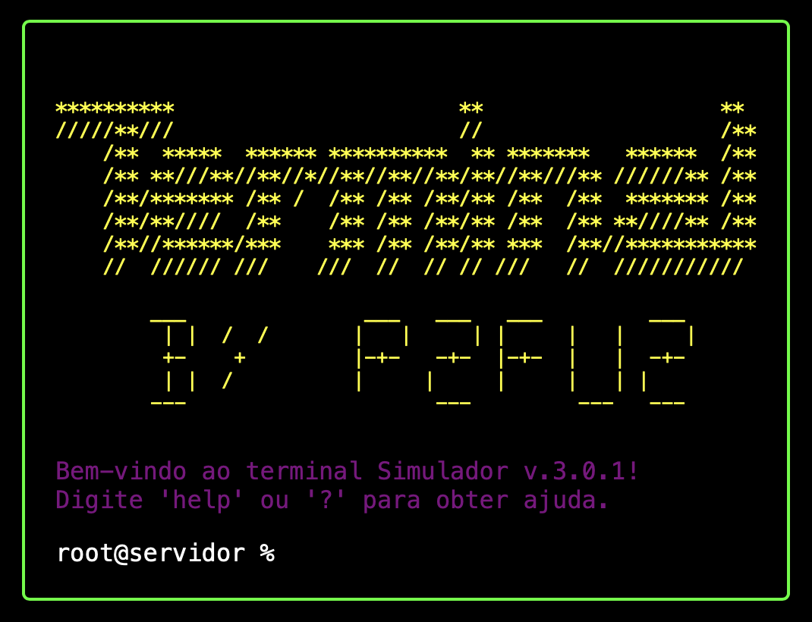

# Simulador de Terminal v.3.0.1

Bem-vindo ao **Simulador de Terminal v.3.0.1**, sua experiência virtual de terminal com diversas funcionalidades interessantes.

## Descrição

Este simulador imita um terminal de computador e é capaz de executar várias funções, desde cálculos matemáticos até retornar citações filosóficas. É a combinação perfeita de funcionalidade e diversão!

## Como usar

**Comandos disponíveis:**
- `.calc <expressão>`: Calcula uma expressão matemática.
  - Exemplo: `.calc 1 + 1`
  - Suporta: Adição, Subtração, Multiplicação, Divisão, Exponenciação, Raiz Quadrada e Resolução de Equações Quadráticas.
- `.filosofia`: Exibe uma citação filosófica aleatória.
- `.anime`: Exibe informações sobre um anime aleatório.
- `.prog`: Exibe um erro comum de programação.
- `.finance`: Exibe uma fórmula financeira aleatória e sua descrição.
- `.date`: Mostra a data atual em diferentes calendários (Gregoriano, Chinês, Hebraico, Islâmico).
- `.time`: Mostra o horário atual em diferentes fusos horários.
- `.story`: Conta uma história interativa curta.
- `.riddle`: Apresenta um enigma para o usuário resolver.
- `help` ou `?`: Exibe uma lista de todos os comandos disponíveis e suas descrições.

**Histórico de Comandos:**
- Use as teclas `ArrowUp` e `ArrowDown` para navegar pelo histórico de comandos.

## Funcionalidades

- Efeitos de Digitação Dinâmicos.
- Avaliação Segura de Expressões Matemáticas.
- Diversas Funções Interativas para Engajamento e Diversão.
- Histórico Persistente de Comandos.
- ... e muito mais!

## Instalação

Este é um projeto baseado em JavaScript. Para executá-lo, você precisa:
1. Clonar o repositório.
2. Abrir o arquivo `index.html` em um navegador web moderno.

## Contribuições

Contribuições são sempre bem-vindas! Se você tem uma ideia de melhoria ou encontrou um bug, sinta-se à vontade para abrir uma Issue ou Pull Request.

## Licença

Este projeto está licenciado sob a Licença MIT - consulte o arquivo `LICENSE` para obter detalhes.

